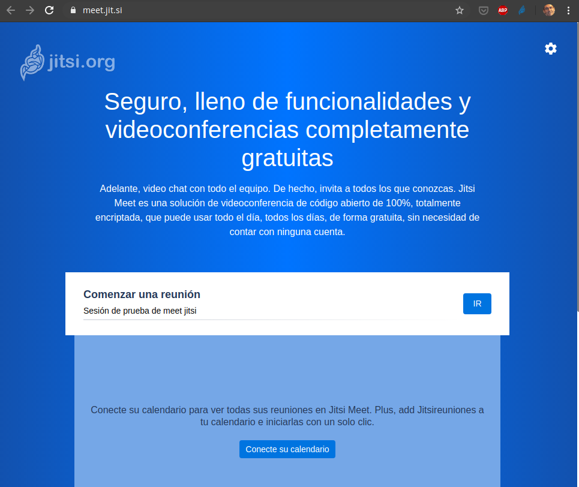

# MiniTutorial sobre videollamada con Meet de Jitsi

 by @javacasm

[Jitsi Meet](https://meet.jit.si/) es una herramienta open source de videoconferencia gratuita que se puede usar online sin tener que instalar nada. Incluye videoconferencia con audio y vídeo, multiusuarios (sin número máximo de usuarios, más allá del límite de ancho de banda). Al ser una herramienta web se puede usar en cualquier sistema operativo: PC con Windows, Linux, MacOS, Raspberry Pi, ... También existen apps para [iOS](https://itunes.apple.com/us/app/jitsi-meet/id1165103905) y para [Android](https://play.google.com/store/apps/details?id=org.jitsi.meet) que se pueden usar en móviles como en tabletas

Podemos usar su infraestructura y empezar una videollamada sin más que entrar en [https://meet.jit.si/](https://meet.jit.si/), establecer el nombre de nuestra reunión y pulsar  **IR**

A partir de este nombre se generará una URL para que se conecten los participantes. Desde los dispositivos móviles será este nombre el que usen para conectarse

Nombre de la sesión

URL 

Estos datos serán los que compartamos con los participantes.

Al conectar veremos la pantalla con los siguientes controles

Si pulsamos en **...** tendremos acceso a muchas opciones

Como:
* Configurar la calidad de la transmisión de vídeo, con lo que podemos mejorar el rendimiento en redes con menor ancho de banda
* Iniciar la grabación, que se guarda en dropbox (por lo que hace falta tener espacio y haberlo configurado con nuestra cuenta)
* Iniciar transmisión en vivo que se hará a través de youtube y que también podemos usar para grabar. Para ello necesitamos hacer iniciado una  transmisión en vivo en Youtube, configurado los codificadores. (Para poder hacer una transmisión en vivo la cuenta tiene que estar autorizada y al menos tener 1000 suscriptores)
* Compartir un vídeo de Youtube, que sustituirá a la transmisión del micro y de la cámara
* Silenciar a todo el mundo
* Ver a pantalla completa
* Configurar en **Ajustes**
    * Los dispositivos, seleccionando el micrófono, la cámara y la salida de audio. Desde aquí se puede dar permiso para utilizar los dispositivos si no se ha dado ya.
    
    En cualquier momento podemos cambiar el dispositivo que usamos

    * En la pestaña **Perfil** podemos poner nuestro nombre y el email
    
    * En la pestañas **Más**  podemos establecer cómo inician los usuarios 
    

A la derecha veremos los usuarios conectados, con una indicación de si tienen activo el vídeo y el audio

Pulsando sobre esos iconos podemos silenciar su audio

Abajo a la izquierda hay 3 iconos con los que usuario puede:

* Compartir su escritorio pulsado en el icono correspondiente

* Levantar la mano para indicar que necesita algo

* Abrir el chat. Al pulsar el botón de **Chat** se abrirá una ventana donde podemos conversar o compartir con los otros participantes

## Creando nuestra infraestructura

Usando la URL de meet.jit.si estamos utilizando la infraestructura de jitsi.org 

También podemos instalar [todos los paquetes del sevidor](https://jitsi.org/downloads/) en nuestra propia infraestructura y así mejorar el rendimiento

## TODO

### Apps

[iOS](https://itunes.apple.com/us/app/jitsi-meet/id1165103905) 

[Android](https://play.google.com/store/apps/details?id=org.jitsi.meet) 

